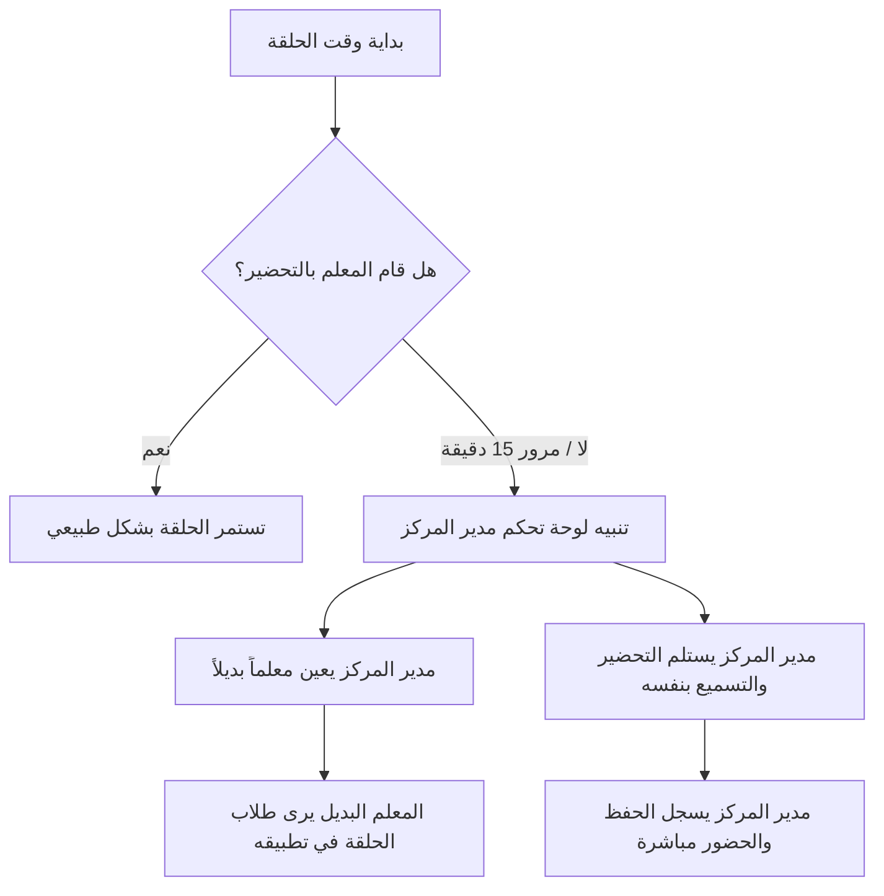

# دليل تصميم نظام معالجة غياب المعلم دون بديل 👨‍🏫❌

يقدم هذا المستند توثيقاً برمجياً وتصميماً معمارياً متكاملاً لحل مشكلة غياب معلم الحلقة دون تعيين بديل مسبق، وكيفية التعامل مع هذه الحالة من قبل إدارة المركز وتوزيع الصلاحيات ديناميكياً.

---

## 1. فلسفة الحل وتجربة المستخدم (UX Flow)



1. **التتبع التلقائي (Automatic Monitoring):** يقوم النظام بمقارنة وقت بدء الحلقة الفعلي مع تحضير المعلم اليومي.
2. **تنبيه الإدارة (Admin Alert):** في حال مرور 15 دقيقة من وقت البدء دون تسجيل حضور أو تفاعل من المعلم، يتم إطلاق إشعار عالي الأهمية لمدير المركز في لوحة التحكم (الويب والموبايل).
3. **التحكم الفوري (Instant Overtake):** يُتاح لمدير المركز خياران:
   - **الخيار الأول:** تعيين معلم بديل مؤقت من القائمة (Substitute Teacher).
   - **الخيار الثاني:** استلام إدارة الحلقة والتحضير بنفسه (Overtake by Admin).

---

## 2. تحديثات قاعدة البيانات (Database Schema Extensions)

لتطبيق هذا النظام على جداول قاعدة البيانات (Supabase & SQLite)، نوصي بالهيكل التالي:

### أ. جدول سجلات الغياب والمناوبات (`teacher_absences`)
يسجل حالات الغياب والبدلاء لكل يوم.
```sql
CREATE TABLE teacher_absences (
    id UUID PRIMARY KEY DEFAULT gen_random_uuid(),
    center_id UUID REFERENCES centers(id) ON DELETE CASCADE,
    halaqah_id UUID REFERENCES halaqat(id) ON DELETE CASCADE,
    absent_teacher_id UUID REFERENCES profiles(id) ON DELETE CASCADE,
    substitute_teacher_id UUID REFERENCES profiles(id) ON DELETE SET NULL, -- المعلم البديل
    date DATE NOT NULL DEFAULT CURRENT_DATE,
    status VARCHAR(20) DEFAULT 'unresolved', -- 'unresolved', 'substituted', 'overtaken_by_admin'
    created_at TIMESTAMP WITH TIME ZONE DEFAULT TIMEZONE('utc'::text, NOW()),
    UNIQUE(halaqah_id, date)
);
```

### ب. تعديل جدول الحلقات (`halaqat`)
إضافة حقل المعلم البديل المؤقت (يتم تصفيره تلقائياً كل ليلة).
```sql
ALTER TABLE halaqat 
ADD COLUMN substitute_teacher_id UUID REFERENCES profiles(id) ON DELETE SET NULL;
```

---

## 3. منطق الخادم والسحابة (Supabase Edge Functions / Postgres Triggers)

لتفعيل الكشف التلقائي بعد 15 دقيقة، نقوم بجدولة Cron Job أو إنشاء دالة تحكم:

```javascript
// دالة التحقق من غياب المعلم (Supabase Edge Function)
export async function checkTeacherAbsences() {
  const now = new Date();
  const currentTime = now.toTimeString().split(' ')[0]; // HH:MM:SS
  
  // 1. جلب الحلقات التي بدأت قبل 15 دقيقة ولم يتم بدء التحضير فيها
  const { data: activeHalaqat, error } = await supabase
    .from('halaqat')
    .select('id, name, start_time, teacher_id, center_id')
    .filter('start_time', 'lt', subtractMinutes(currentTime, 15));

  for (const halaqah of activeHalaqat) {
    // التحقق من وجود حضور مسجل لهذا اليوم
    const { count } = await supabase
      .from('attendance')
      .select('id', { count: 'exact' })
      .eq('halaqa_id', halaqah.id)
      .eq('date', now.toISOString().split('T')[0]);

    if (count === 0) {
      // إرسال إشعار لمدير المركز بوجود حلقة بدون معلم
      await triggerAdminNotification(
        halaqah.center_id,
        `الحلقة "${halaqah.name}" بدون معلم حالياً!`,
        `مرّت 15 دقيقة على موعد بدء الحلقة دون تسجيل تحضير.`
      );
    }
  }
}
```

---

## 4. تطبيق الواجهات (UI/UX Mockup Codes)

### أ. على مستوى واجهة الويب (Next.js - React)

شاشة تحذيرية تظهر لمدير المركز في الصفحة الرئيسية:
```tsx
export function AbsenceAlertCard({ halaqahName, onOvertake, onAssignSubstitute }) {
  return (
    <div className="bg-rose-50 border-2 border-rose-200 rounded-3xl p-6 text-right animate-pulse">
      <h4 className="text-rose-900 font-black text-lg">⚠️ حلقة بدون معلم حالياً!</h4>
      <p className="text-rose-700 text-xs mt-1 font-bold">
        الحلقة ({halaqahName}) بدأت منذ 15 دقيقة ولم يسجل المعلم أي حضور أو تسميع لليوم.
      </p>
      <div className="flex gap-4 mt-6">
        <button 
          onClick={onOvertake}
          className="bg-rose-600 hover:bg-rose-700 text-white px-4 py-2.5 rounded-xl text-xs font-black"
        >
          استلام الحلقة بنفسي 🛡️
        </button>
        <button 
          onClick={onAssignSubstitute}
          className="bg-white border border-rose-200 text-rose-700 hover:bg-rose-100 px-4 py-2.5 rounded-xl text-xs font-black"
        >
          تعيين معلم بديل 👥
        </button>
      </div>
    </div>
  );
}
```

### ب. على مستوى تطبيق الموبايل (Flutter - Dart)

عند قيام مدير المركز أو المعلم البديل باستلام مهام التسميع، يتم تعديل استعلام جلب الطلاب ليتضمن طلاب الحلقة البديلة:

```dart
// في خدمة الطلاب (Student Database query)
Future<List<Student>> getStudentsForTeacher(String teacherId) async {
  final db = await database;
  
  // جلب الطلاب التابعين للحلقة الأساسية للمعلم، أو الحلقة التي تم تعيينه بديلاً لها لليوم
  return await db.rawQuery('''
    SELECT s.* FROM students s
    JOIN halaqat h ON s.halaqa_id = h.id
    WHERE h.teacher_id = ? OR h.substitute_teacher_id = ?
  ''', [teacherId, teacherId]);
}
```

---

## 5. خطة المزامنة عند انقطاع الإنترنت (Offline Handling)

1. إذا كان مدير المركز يستخدم **تطبيق الموبايل** في وضع عدم الاتصال بالإنترنت، يمكنه الانتقال يدوياً لقسم الحلقات واختيار "تعديل حلقة" واستلام التسميع بشكل محلي.
2. عند عودة الإنترنت، يقوم نظام المزامنة السحابي (الذي نناقشه في المرحلة 6) بمزامنة السجل وتصفير حقل `substitute_teacher_id` في نهاية اليوم.
